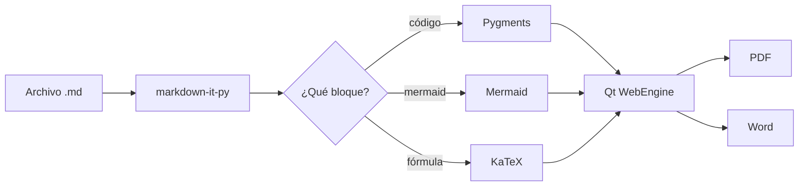
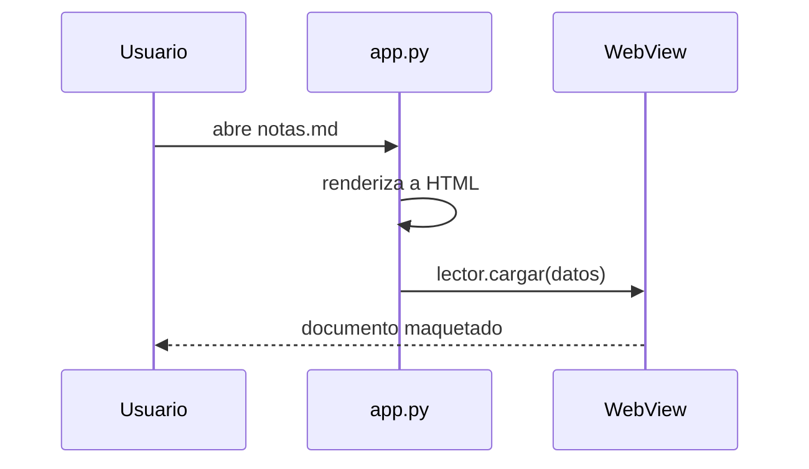

# Guía de demostración

Este documento existe para comprobar que **todo** lo que renderiza `lectorMD`
funciona: tipografía, código, tablas, diagramas, fórmulas y avisos.

## Texto y énfasis

Texto normal con **negrita**, *cursiva*, ***ambas***, ~~tachado~~, `código en línea`
y un [enlace externo](https://daringfireball.net/projects/markdown/).

> Una cita simple, sin adornos, para ver cómo respira el bloque.

### Avisos

> [!NOTE]
> Los bloques de aviso usan la misma sintaxis que GitHub.

> [!TIP]
> Pulsa <kbd>F9</kbd> para ocultar el índice lateral.

> [!WARNING]
> Si el archivo cambia en disco, la vista se recarga sola.

> [!CAUTION]
> Las rutas relativas de las imágenes se resuelven desde la carpeta del `.md`.

## Código

Con resaltado de Pygments y botón de copiar:

```python
from dataclasses import dataclass

@dataclass
class Documento:
    titulo: str
    palabras: int = 0

    def resumen(self) -> str:
        return f"{self.titulo} ({self.palabras} palabras)"
```

```bash
# Abrir un documento desde la terminal
lectormd ~/Documentos/notas.md
```

```sql
SELECT autor, COUNT(*) AS total
FROM documentos
WHERE palabras > 500
GROUP BY autor
ORDER BY total DESC;
```

## Listas

Normal:

1. Primer paso
2. Segundo paso
   - Detalle anidado
   - Otro detalle
3. Tercer paso

De tareas:

- [x] Renderizar Markdown
- [x] Resaltado de sintaxis
- [x] Índice navegable
- [x] Exportar a PDF y Word
- [ ] Modo presentación

## Tablas

| Componente | Tecnología | Peso |
|------------|------------|-----:|
| Ventana | Qt 6 (PySide6) | — |
| Render | Qt WebEngine (Chromium) | 195 MB |
| Markdown | markdown-it-py | 1 MB |
| Diagramas | Mermaid 12 | 4,5 MB |
| Word | python-docx | 1 MB |

## Fórmulas

En línea: la identidad de Euler $e^{i\pi} + 1 = 0$ dentro de un párrafo normal.
Los precios como $20 o $1500 no se confunden con fórmulas.

En bloque:

$$
\int_{-\infty}^{\infty} e^{-x^2} \, dx = \sqrt{\pi}
$$

$$
\frac{\partial}{\partial t}\Psi(x,t) = \frac{i\hbar}{2m}\nabla^2\Psi(x,t)
$$

## Diagramas





## Cierre

---

Fin de la demostración.
